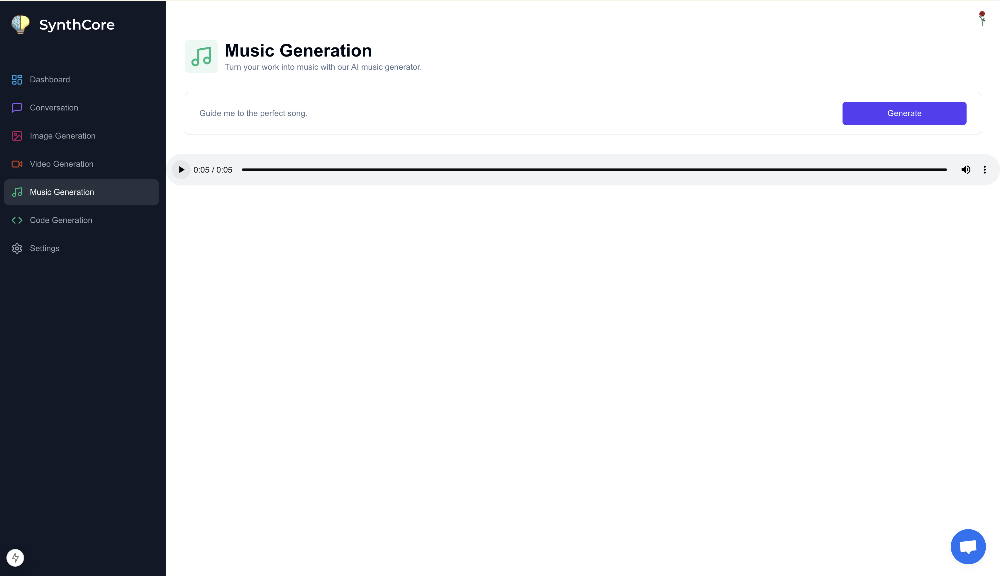

*SynthCore*
SynthCore is an AI-driven platform built with TypeScript, designed to simplify the creative and development process for users. By providing tools to generate text, music, images, videos, and code, it eliminates repetitive tasks and reduces the time spent on manual work. SynthCore solves the challenge of accessing reliable, high-quality AI tools in one place, offering a streamlined experience for creators, developers, and businesses. With integrated customer support, it ensures users can focus on their ideas while the platform handles the complexity.

*Features*
🎨 *Image Generation*
Generate stunning visuals from descriptive prompts.

🎵 *Music Generation*
Compose custom soundtracks and melodies powered by AI.

🎥 *Video Generation*
Transform your ideas into engaging video content.

💻 *Code Generation*
Generate accurate and optimized code snippets.

💬 *AI Conversations*
Engage in intelligent and context-aware conversations.

💳 *Secure Payments with Stripe*
Handle subscriptions and payments securely using Stripe.
Upgrade to the Pro Plan for unlimited access.

🤝 *Customer Support*
24/7 Support: Get assistance whenever needed.
Dedicated Team: Resolve issues quickly to enhance your experience.

*Clerk Authentication*
User Verification for secure login
Option to create account through email

*Technology Stack*
TypeScript: Type-safe and reliable.
Next.js: Framework for building server-side and static web applications.
Tailwind CSS: Modern and responsive UI design.
Prisma: Database ORM for PostgreSQL.
OpenAI API: The brain behind the AI functionalities.
Clerk: Authentication and user management.
Stripe: Secure payment and subscription management.
Core Values
Efficiency: Fast and responsive AI tools.
Scalability: Designed to handle high user traffic.
Customizability: Tailored outputs to meet user needs.
Customer Support: Ensuring seamless and reliable user experiences.

*Core Values*
Efficiency: Fast and responsive AI tools.
Scalability: Designed to handle high user traffic.
Customizability: Tailored outputs to meet user needs.
Customer Support: Ensuring seamless and reliable user experiences.

